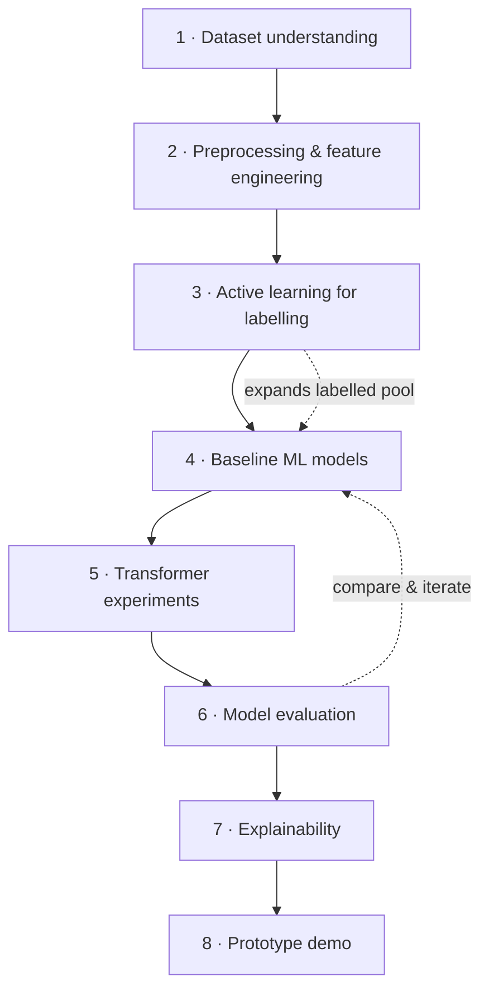
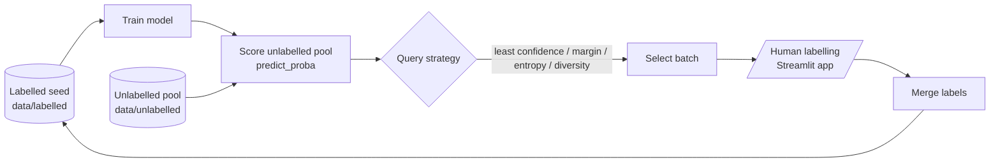

# Project Overview

> The *why* and *what* of the project. For *how to work in the repo*, see [README.md](README.md). For *where things live*, see [STRUCTURE.md](STRUCTURE.md).

## Background

Pull Requests are central to modern collaborative software development. They let developers propose changes, receive feedback, run automated checks, and merge code into shared branches. But not every PR carries the same level or type of risk, and the risk signals are scattered across metadata, text, code changes, comments, CI results, and review activity.

## Problem

Reviewers may miss PRs that need extra attention because risk signals are spread out and easy to overlook in active repositories. Risky PRs can introduce defects, failed builds, integration failures, security weaknesses, performance regressions, or maintainability issues. Existing approaches are mostly **binary** (risky / non-risky or accept / reject) and offer **limited explainability**, so developers cannot see *why* a PR is flagged or *what type* of risk it carries.

## Proposed solution

An **explainable machine-learning and deep-learning system** that:

1. Predicts whether a PR is risky (`is_risky`).
2. Identifies the most likely **risk type** (`risk_type`).
3. Provides understandable **explanations** for each prediction.
4. Suggests practical **mitigation actions**.

To get fine-grained labels without prohibitive manual effort, the project uses **active learning** to extend PRismBench from binary labels to multi-class risk categories.

## Research questions

| RQ | Question | Addressed by |
|---|---|---|
| **RQ1** | How can GitHub PR data classify risks into fine-grained categories (bug, performance, security, …)? | Feature engineering + baseline & transformer models (notebooks 02–05) |
| **RQ2** | How can XAI give developers understandable reasons for predictions? | SHAP / LIME / feature importance → mitigation suggestions (notebook 06) |
| **RQ3** | How can active learning reduce labelling effort to go from binary to multi-class labels? | Query-strategy simulation + labelling app (notebook 04, `app/labelling_app`) |

## Dataset

The project uses **PRismBench**, ~28,000 GitHub PR records. The real dataset is **not** committed — place local copies under `data/raw/` (gitignored). Expected feature groups: PR metadata, textual descriptions, code-change summaries, review activity, CI information, comments, and other PR attributes. A 10-row synthetic `data/sample/sample_prs.csv` is committed so the toolchain runs without the real data. See [`docs/dataset_description.md`](docs/dataset_description.md).

## Risk taxonomy

Single primary class per PR in v1 (multi-label is future work). Defined in [`annotation/label_schema.md`](annotation/label_schema.md) and [`docs/risk_taxonomy.md`](docs/risk_taxonomy.md).

| Class | Family | Example signals |
|---|---|---|
| `non_risky` | — | Small, well-tested, low-impact change |
| `bug_risk` | Correctness | Logic regressions, edge-case failures, broken features |
| `security_risk` | Security | Auth/authz changes, secrets, injection, vulnerable deps |
| `performance_risk` | Performance | Latency, memory, expensive queries, caching, scalability |
| `maintainability_risk` | Quality | Complexity, duplication, fragile or hard-to-read design |
| `integration_risk` | Integration | APIs, schemas, service boundaries, external systems |
| `build_ci_risk` | Delivery | Failed CI, build/deploy scripts, dependency locks, packaging |
| `test_risk` | Testing | Removed/missing/weak/flaky tests |
| `documentation_config_risk` | Docs/Config | Wrong docs, setup, env vars, config files |
| `other_risk` | — | A clear risk fitting none above |
| `unsure` | — | Insufficient or ambiguous information |

## Methodology

| Stage | Focus | Where |
|---|---|---|
| 1 · Dataset understanding | Features, labels, class balance, missing values | nb 01, `data/` |
| 2 · Preprocessing & features | Cleaning, text normalisation, metadata + text features | nb 02–03, `src/pr_risk/data`, `features` |
| 3 · Active learning | Seed → query → label → merge | nb 04, `src/pr_risk/active_learning`, `annotation/` |
| 4 · Baseline models | Logistic Regression, Random Forest, XGBoost/LightGBM | nb 03, `src/pr_risk/models` |
| 5 · Transformers | CodeBERT and embedding-based models | nb 05, `configs/codebert.yaml` |
| 6 · Evaluation | Accuracy, precision, recall, F1, ROC-AUC, confusion matrices | nb 03/07, `src/pr_risk/utils/metrics` |
| 7 · Explainability | Feature importance, SHAP, LIME → suggestions | nb 06, `src/pr_risk/explainability` |
| 8 · Prototype | Labelling app + prediction/explanation API | `app/` |

## Active learning loop

Active learning starts from a small labelled **seed**, trains a model, scores the **unlabelled pool**, and uses a **query strategy** to select the most informative PRs for human labelling. Newly labelled PRs are merged back, and the cycle repeats for several rounds — reaching useful accuracy with far fewer labels than random labelling.

Strategies implemented in [`src/pr_risk/active_learning/query_strategies.py`](src/pr_risk/active_learning/query_strategies.py): `random_sampling`, `least_confidence_sampling`, `entropy_sampling`, `margin_sampling`, and a `diversity_sampling` placeholder. The end-to-end orchestrator (`active_learning_loop`) is a planned placeholder; notebook 04 simulates the loop inline. See [`docs/active_learning_plan.md`](docs/active_learning_plan.md).

## Explainability

Explainability methods — feature importance, **SHAP**, **LIME**, and attention-based explanations — identify the influential factors behind a prediction. The explanation component converts model signals into practical advice:

| Signal | Suggested mitigation |
|---|---|
| Large diff / many files | Split the PR into smaller changes |
| CI failed | Investigate failing checks before merge |
| Security-sensitive paths | Request a security-focused review |
| Tests removed / missing | Add or restore tests |
| Low review activity on risky change | Request additional reviewers |

See [`docs/explainability_plan.md`](docs/explainability_plan.md).

## Expected outcome

- A trained and evaluated **PR risk prediction** system (`is_risky`).
- A **risk-type classifier** (`risk_type`).
- An **active-learning workflow** to extend labels efficiently.
- An **explainability module** that produces reasons and mitigation suggestions.
- A **prototype** demonstrating predictions, explanations, and risk-reduction advice.

## Literature review

A full literature review backs this project (RQs, related work, model/AL/XAI methods, and tools). A summary with comparison tables is in [`docs/README.md`](docs/README.md), which also links the source document.
