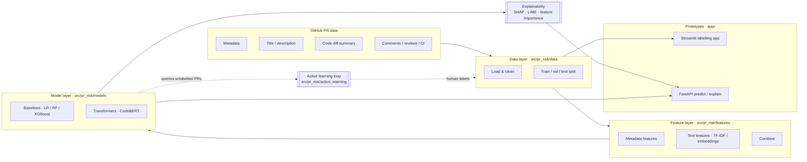
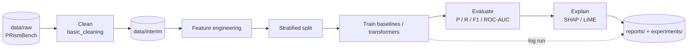
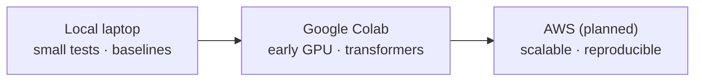

# Explainable Pull Request Risk Prediction using Active Learning

> Final Year Project — predicting and explaining the risk of GitHub Pull Requests (PRs) before they are merged, using the **PRismBench** dataset (~28,000 PR records).

[](pyproject.toml)
[](.github/workflows/python-checks.yml)
[](LICENSE)
[](#project-status)

This repository is the team starter implementation. It predicts two related targets for each PR:

| Target | Meaning | Values |
|---|---|---|
| `is_risky` | Whether a PR is risky | `0` non-risky · `1` risky · `2` unsure |
| `risk_type` | The primary type of risk | one of 11 classes (see [Risk labels](#risk-labels)) |

Version 1 uses **single-label** risk-type classification (one primary `risk_type` per PR); the structure supports a later multi-label extension.

> **New here?** Read [PROJECT_OVERVIEW.md](PROJECT_OVERVIEW.md) for the *why*, then this file for *how to work*, then [STRUCTURE.md](STRUCTURE.md) for *where things live*, then start with [`notebooks/01_data_exploration.ipynb`](notebooks/01_data_exploration.ipynb).

---

## Table of contents

- [Problem statement](#problem-statement)
- [Research questions](#research-questions)
- [System architecture](#system-architecture)
- [End-to-end pipeline](#end-to-end-pipeline)
- [Repository structure](#repository-structure)
- [Risk labels](#risk-labels)
- [Local environment setup](#local-environment-setup)
- [How to run an experiment](#how-to-run-an-experiment)
- [Notebooks](#notebooks)
- [Compute environments](#compute-environments-local--colab--aws)
- [How to work here (team workflow)](#how-to-work-here-team-workflow)
- [Documentation index](#documentation-index)
- [Project status](#project-status)

---

## Problem statement

Modern teams use Pull Requests to review changes before merging. Some PRs introduce bugs, security weaknesses, failed builds, performance regressions, integration issues, test gaps, or maintainability problems. Risk signals are spread across metadata, text, code changes, comments, CI results, and review activity, so reviewers can miss the PRs that need the most attention.

This project builds an **explainable ML/DL system** that predicts PR risk *before merge time*, identifies the likely risk type, explains *why* the prediction was made, and suggests practical mitigation actions. **Active learning** is used to extend PRismBench from binary labels to fine-grained risk categories while minimising manual labelling effort.

## Research questions

| RQ | Question |
|---|---|
| **RQ1** | How can GitHub PR data be used to classify PR risks into fine-grained categories (e.g. bugs, performance, security)? |
| **RQ2** | How can explainable-AI techniques give developers understandable reasons for PR risk predictions? |
| **RQ3** | How can active learning reduce the manual effort of extending PRismBench from binary to fine-grained multi-class labels? |

See [`docs/README.md`](docs/README.md) for a summary of the supporting literature review.

## System architecture



## End-to-end pipeline



## Repository structure

```text
pr-risk-prediction/
├─ README.md              ← you are here (how to work)
├─ PROJECT_OVERVIEW.md    ← why this project exists + methodology
├─ STRUCTURE.md           ← detailed folder-by-folder reference
├─ pyproject.toml         ← tooling (black, ruff, pytest) + metadata
├─ requirements.txt       ← pip dependencies
├─ environment.yml        ← conda environment
├─ .env.example           ← template for secrets (copy to .env, never commit .env)
├─ data/                  ← datasets by stage (raw → interim → processed; labelled/unlabelled; sample)
├─ annotation/            ← label schema, guidelines, templates, batches
├─ notebooks/             ← 01–07 exploration & experiment narratives
├─ src/pr_risk/           ← reusable Python package (data, features, models, active_learning, explainability, utils)
├─ configs/               ← YAML model & experiment configs
├─ experiments/           ← lightweight CSV experiment tracking
├─ models/                ← local model outputs & checkpoints (gitignored binaries)
├─ reports/               ← figures, tables, comparisons, final results
├─ app/                   ← Streamlit labelling app + FastAPI backend
├─ docs/                  ← academic planning, dataset, evaluation, AL, XAI, taxonomy
├─ colab/                 ← Google Colab setup + starter notebook
├─ scripts/               ← setup / test / sample-experiment helpers
└─ tests/                 ← pytest tests (run on sample/synthetic data)
```

| Folder | Purpose | Commit policy |
|---|---|---|
| [`data/`](data/README.md) | Datasets by lifecycle stage | Docs, templates, `sample/` only — **never real PRismBench data** |
| [`annotation/`](annotation/README.md) | Labelling schema, guidelines, batches | Schema & guidelines yes; review batches before committing |
| [`notebooks/`](notebooks/README.md) | Exploration & experiment narratives | Yes, cleaned of large outputs & private data |
| [`src/pr_risk/`](src/pr_risk/README.md) | Reusable package code | Yes — all source |
| [`configs/`](configs/README.md) | Reproducible YAML settings | Yes |
| [`experiments/`](experiments/README.md) | CSV run logs & summaries | Templates & curated summaries only |
| [`models/`](models/README.md) | Trained models & checkpoints | READMEs/`.gitkeep` only — **no binaries** |
| [`reports/`](reports/README.md) | Final figures, tables, comparisons | Small final assets only |
| [`app/`](app/README.md) | Streamlit + FastAPI prototypes | Yes |
| [`docs/`](docs/README.md) | Planning & methodology docs | Yes |
| [`colab/`](colab/README.md) | Colab setup & starter notebook | Yes (no Drive-mounted data) |
| [`scripts/`](scripts/README.md) | CLI helpers | Yes (no secrets) |
| [`tests/`](tests/README.md) | pytest tests | Yes |

Full details with the commit/`.gitignore` rationale are in [STRUCTURE.md](STRUCTURE.md).

## Risk labels

The taxonomy is defined in [`annotation/label_schema.md`](annotation/label_schema.md) and [`docs/risk_taxonomy.md`](docs/risk_taxonomy.md).

| `risk_type` | When to use it |
|---|---|
| `non_risky` | `is_risky = 0`; no risk present |
| `bug_risk` | Functional defects, incorrect behaviour, edge-case or logic regressions |
| `security_risk` | Auth, secrets, injection, dependency vulnerabilities, sensitive-data exposure |
| `performance_risk` | Latency, memory, DB query, caching, throughput, scalability |
| `maintainability_risk` | Hard-to-read code, excessive complexity, duplication, fragile design |
| `integration_risk` | Interfaces between services, modules, APIs, schemas, external systems |
| `build_ci_risk` | Failed CI, build/deploy scripts, dependency locks, packaging |
| `test_risk` | Tests removed, missing, weak, flaky, or insufficient |
| `documentation_config_risk` | Wrong docs, setup instructions, env vars, config files |
| `other_risk` | A clear risk that fits none of the above |
| `unsure` | Annotator cannot confidently pick one primary class |

## Local environment setup

**Prerequisites:** Python 3.10+ (the project is tested on 3.11), Git, and ~5 GB free disk if you install the deep-learning extras (`torch`, `transformers`).

### Option A — `venv` + pip (recommended for laptops)

Windows (PowerShell):

```powershell
python -m venv .venv
.\.venv\Scripts\Activate.ps1
python -m pip install --upgrade pip
pip install -r requirements.txt
pytest
```

Linux / macOS:

```bash
python -m venv .venv
source .venv/bin/activate
pip install -r requirements.txt
pytest
```

You can also use the helper scripts: [`scripts/setup_env.ps1`](scripts/setup_env.ps1) (Windows) or [`scripts/setup_env.sh`](scripts/setup_env.sh) (Unix).

### Option B — conda

```bash
conda env create -f environment.yml
conda activate pr-risk-env
pytest
```

### Lightweight install (no deep learning)

The transformer/XAI extras (`torch`, `transformers`, `sentence-transformers`, `shap`, `lime`) are heavy. For data exploration and baseline modelling you only need the core stack — install just what you need:

```bash
pip install pandas numpy scipy scikit-learn matplotlib seaborn pyyaml jupyter ruff pytest
```

Notebooks `05` (deep learning) and `06` (explainability) **guard** their heavy imports, so they still open and run their light sections without these packages.

### Secrets

Copy `.env.example` to `.env` and fill in any tokens (e.g. a GitHub token if you collect data). `.env` is gitignored — never commit it.

## How to run an experiment

Everything below runs on the committed **10-row sample** (`data/sample/sample_prs.csv`) — no real data required — so you can validate the toolchain end-to-end in minutes.

1. **Place data (real runs):** put the real PRismBench file in `data/raw/` (gitignored). For a first run, skip this and use the sample.
2. **Explore:** open [`notebooks/01_data_exploration.ipynb`](notebooks/01_data_exploration.ipynb) → schema, class balance, missing values, distributions.
3. **Preprocess:** [`notebooks/02_preprocessing.ipynb`](notebooks/02_preprocessing.ipynb) → clean, normalise text, split, write to `data/interim/`.
4. **Baselines:** [`notebooks/03_baseline_models.ipynb`](notebooks/03_baseline_models.ipynb) → metadata + TF-IDF features, train LR/RF, evaluate.
5. **Active learning:** [`notebooks/04_active_learning_simulation.ipynb`](notebooks/04_active_learning_simulation.ipynb) → simulate query strategies and learning curves.
6. **Deep learning:** [`notebooks/05_deep_learning_experiments.ipynb`](notebooks/05_deep_learning_experiments.ipynb) → CodeBERT/embedding scaffold (heavy parts gated).
7. **Explainability:** [`notebooks/06_explainability.ipynb`](notebooks/06_explainability.ipynb) → feature importance, SHAP, LIME → mitigation suggestions.
8. **Results:** [`notebooks/07_results_analysis.ipynb`](notebooks/07_results_analysis.ipynb) → compare runs, export figures.
9. **Track it:** append a row to [`experiments/experiment_log.csv`](experiments/experiment_log.csv) (see [`scripts/create_sample_experiment.py`](scripts/create_sample_experiment.py)) and export curated outputs to [`reports/`](reports/README.md).

> **Sample vs. real data:** the sample has only 10 rows with singleton classes, so stratified splitting and `risk_type` modelling are *illustrative only*. On the real dataset, use the package's stratified [`create_train_val_test_split`](src/pr_risk/data/split_data.py). Every notebook marks these spots with a `TODO`.

## Notebooks

| # | Notebook | What it does | Primary `pr_risk` modules |
|---|---|---|---|
| 01 | [data_exploration](notebooks/01_data_exploration.ipynb) | Schema, class balance, missing values, distributions | `data.load_data` |
| 02 | [preprocessing](notebooks/02_preprocessing.ipynb) | Clean, normalise text, split, persist | `data.clean_data`, `data.preprocess`, `data.split_data` |
| 03 | [baseline_models](notebooks/03_baseline_models.ipynb) | Feature sets, train LR/RF, evaluate | `features.*`, `models.train_baseline`, `models.evaluate` |
| 04 | [active_learning_simulation](notebooks/04_active_learning_simulation.ipynb) | Query strategies, learning curves | `active_learning.query_strategies` |
| 05 | [deep_learning_experiments](notebooks/05_deep_learning_experiments.ipynb) | CodeBERT / embeddings scaffold (gated) | `utils.config`, `configs/codebert.yaml` |
| 06 | [explainability](notebooks/06_explainability.ipynb) | Feature importance, SHAP, LIME → suggestions | `explainability.*` |
| 07 | [results_analysis](notebooks/07_results_analysis.ipynb) | Compare runs, plots, export figures | `utils.paths`, `experiments/*.csv` |

Keep reusable logic in `src/pr_risk/`; keep notebooks thin (import and call). Strip large outputs before committing.

## Compute environments (local · Colab · AWS)



- **Local** — exploration, preprocessing, baseline models, active-learning simulation.
- **Colab** — early GPU experiments. Use [`colab/colab_setup_template.ipynb`](colab/colab_setup_template.ipynb); store real data in a private Drive folder (never commit). See [`colab/README.md`](colab/README.md).
- **AWS (planned)** — S3 storage, SageMaker/JupyterLab, single-GPU for transformers, IAM, CloudWatch, Budgets. See [`docs/aws_resource_request.md`](docs/aws_resource_request.md).

## How to work here (team workflow)


- **Branch per task** — never commit directly to `main`.
- **Keep data & secrets out of Git** — real datasets, `.env`, checkpoints, logs, and large artifacts are gitignored. Double-check before `git add`.
- **Quality gates before every PR:**
  ```bash
  ruff check .
  black .
  pytest
  ```
  CI ([`.github/workflows/python-checks.yml`](.github/workflows/python-checks.yml)) runs `ruff` + `pytest` on push and PRs to `main`.
- **Update tests** when you change package code; tests must use the sample/synthetic data, not the real dataset.
- **Log experiments** in [`experiments/experiment_log.csv`](experiments/experiment_log.csv) and request review from `<YOUR_TEAM_NAME>`.

## Documentation index

| Doc | Read it for |
|---|---|
| [PROJECT_OVERVIEW.md](PROJECT_OVERVIEW.md) | Motivation, methodology, active-learning loop, expected outcomes |
| [STRUCTURE.md](STRUCTURE.md) | Folder-by-folder reference + commit policy |
| [docs/README.md](docs/README.md) | Docs hub + literature-review summary |
| [docs/dataset_description.md](docs/dataset_description.md) | PRismBench notes |
| [docs/experiment_plan.md](docs/experiment_plan.md) | Baseline & feature-set plan |
| [docs/active_learning_plan.md](docs/active_learning_plan.md) | Seed → query → label → merge plan |
| [docs/explainability_plan.md](docs/explainability_plan.md) | SHAP / LIME / suggestions plan |
| [docs/model_evaluation_plan.md](docs/model_evaluation_plan.md) | Metrics & evaluation focus |
| [docs/environment_setup.md](docs/environment_setup.md) | Environment notes |
| [docs/aws_resource_request.md](docs/aws_resource_request.md) | AWS starter request |
| [annotation/annotation_guidelines.md](annotation/annotation_guidelines.md) | How to label PRs |

## Project status

This is a **research scaffold**: the package contains a mix of working helpers (data loading, baselines, feature combination, query strategies, metrics, feature importance) and explicit placeholders (e.g. the active-learning orchestrator and the transformer trainer). Notebooks are built to run on the sample data and clearly mark where the real PRismBench dataset and not-yet-implemented functions plug in. See each subpackage README for an implemented-vs-TODO map.

## Project placeholders

- Team: `<YOUR_TEAM_NAME>`
- Supervisor: `<YOUR_SUPERVISOR_NAME>`
- Repository URL: `<GITHUB_REPO_URL>`
- University / module: `<UNIVERSITY_AND_MODULE>`

## License

Released under the MIT License — see [LICENSE](LICENSE).
