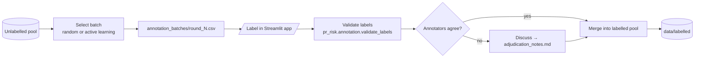

# Annotation

Everything needed to label PRs consistently: the label schema, guidelines, templates, and per-round batches. This supports **RQ3** — extending PRismBench from binary to fine-grained labels with active learning.

## Files

| File | Purpose | Commit? |
|---|---|---|
| [label_schema.md](label_schema.md) | Canonical definition of `is_risky` + the 11 `risk_type` classes | Yes |
| [annotation_guidelines.md](annotation_guidelines.md) | How to decide risky/non-risky, pick a type, handle `unsure` | Yes |
| [adjudication_notes.md](adjudication_notes.md) | Record of how disagreements were resolved | Yes |
| [labelled_samples_template.csv](labelled_samples_template.csv) | Template for labelled rows | Yes |
| [unlabelled_pool_template.csv](unlabelled_pool_template.csv) | Template for the unlabelled pool | Yes |
| [annotation_batches/](annotation_batches/) | Per-round batches selected for labelling | **Review first** — may contain dataset samples |

## Labelling workflow

- Multiple annotators label **independently first**, then reconcile.
- Use the Streamlit labeller in [`app/labelling_app/`](../app/labelling_app/README.md).
- Supporting package code lives in [`src/pr_risk/annotation/`](../src/pr_risk/annotation/README.md): `create_annotation_batch`, `merge_labels`, `validate_labels`, `agreement` (inter-annotator agreement).

## Golden rules

- The taxonomy here is the **single source of truth**; other docs reference it.
- Prefer the label supported by the strongest PR signals; use `unsure` only when genuinely ambiguous.
- Active learning surfaces *hard* PRs, so expect more ambiguity than random sampling — record notes.
