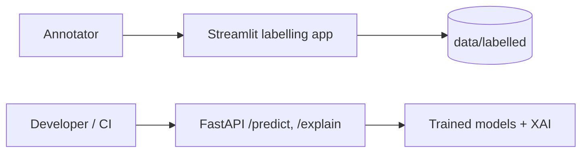

# Application Prototypes

Prototype interfaces for labelling, prediction, and explanation demos. These are thin UIs over the [`pr_risk`](../src/pr_risk/README.md) package.

## Components

| Component | Stack | Status | Run |
|---|---|---|---|
| [`labelling_app/`](labelling_app/README.md) | Streamlit | **Working** — upload a CSV, label rows, save to `data/labelled/` | `streamlit run app/labelling_app/streamlit_app.py` |
| [`backend/`](backend/README.md) | FastAPI | **Placeholder** — `/health`, `/predict`, `/explain` return stub responses | `uvicorn app.backend.main:app --reload` |
| [`frontend/`](frontend/README.md) | TBD | **Empty** — reserved for a future demo UI | — |

## How it fits

## Next steps

- Wire `backend/main.py` `/predict` and `/explain` to trained models via `pr_risk.models.predict` and `pr_risk.explainability`.
- The Streamlit app already writes labelled rows; connect it to `pr_risk.annotation.merge_labels` to fold labels into the pool.

Install the app extras with the main requirements (`streamlit`, `fastapi`, `uvicorn` are in [`requirements.txt`](../requirements.txt)).
