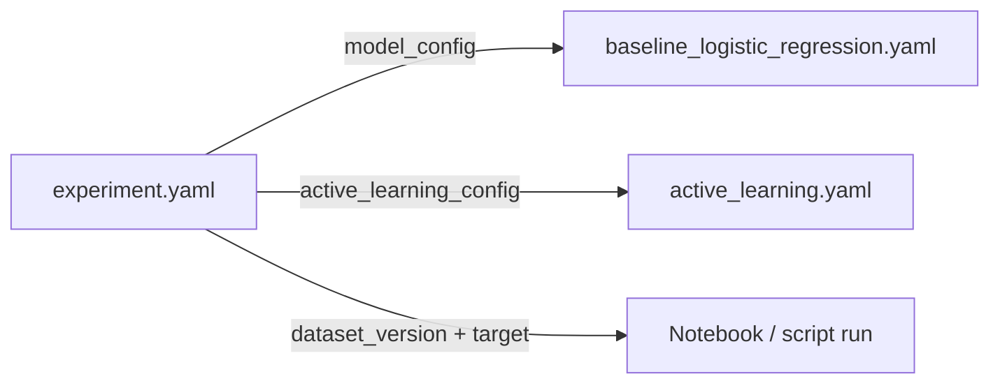

# Configs

YAML files that make experiments reproducible. Change a config here instead of hard-coding values in notebooks or scripts. Load them with [`pr_risk.utils.config`](../src/pr_risk/utils/README.md).

## Files

| File | Kind | task_type | target | Key settings |
|---|---|---|---|---|
| [experiment.yaml](experiment.yaml) | Experiment | binary_risk_prediction | `is_risky` | References a model config + an AL config |
| [baseline_logistic_regression.yaml](baseline_logistic_regression.yaml) | Model | binary_risk_prediction | `is_risky` | `max_iter`, `class_weight: balanced` |
| [baseline_xgboost.yaml](baseline_xgboost.yaml) | Model | binary_risk_prediction | `is_risky` | Gradient-boosted trees |
| [random_forest.yaml](random_forest.yaml) | Model | — | — | RF hyperparameters |
| [codebert.yaml](codebert.yaml) | Model | risk_type_classification | `risk_type` | `microsoft/codebert-base`, `max_length`, `epochs`, `learning_rate` |
| [active_learning.yaml](active_learning.yaml) | Active learning | — | — | `initial_seed_size`, `batch_size`, `rounds`, `strategies[]` |

## How they compose

## Conventions

- One model per model-config; one experiment per `experiment_id`.
- Keep `target` consistent with `task_type` (`is_risky` ↔ binary, `risk_type` ↔ multi-class).
- Commit all configs — they are the reproducibility record. No secrets in configs (use `.env`).
