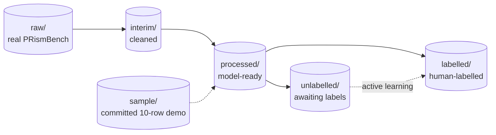

# Data Directory

Datasets organised by lifecycle stage. **Only documentation, templates, and the small synthetic `sample/` are committed** — real PRismBench data and all generated tables are gitignored (see [STRUCTURE.md](../STRUCTURE.md#gitignore-at-a-glance)).

## Data flow

## Stages

| Folder | Stage | Produced by | Committed? |
|---|---|---|---|
| `raw/` | Original PRismBench input | Manual download | No — gitignored |
| `interim/` | Cleaned / partially processed | `pr_risk.data.clean_data`, `preprocess` (nb 02) | No |
| `processed/` | Final model-ready tables/features | nb 02–03 | No |
| `labelled/` | Human-labelled pool | Annotation / active learning | No |
| `unlabelled/` | Pool awaiting labels | Sampling from raw | No |
| `sample/` | 10-row synthetic demo | Committed in repo | **Yes** |

Each subfolder keeps a `.gitkeep` and `README.md` so the structure stays in Git even when the data does not.

## Sample schema (`sample/sample_prs.csv`)

The committed sample lets the whole pipeline run without real data. Columns:

| Column | Type | Notes |
|---|---|---|
| `pr_id` | str | Identifier (e.g. `PR-001`) |
| `repository` | str | `owner/repo` |
| `title`, `description` | str | PR text |
| `files_changed`, `lines_added`, `lines_deleted`, `commits_count`, `comments_count`, `reviewers_count` | int | Metadata features (see `pr_risk.features.metadata_features`) |
| `ci_failed` | bool | CI outcome |
| `code_diff_summary` | str | Short text summary of the diff |
| `is_risky` | int | `0` non-risky · `1` risky · `2` unsure |
| `risk_type` | str | One of the 11 taxonomy classes |

> ⚠️ The sample has only 10 rows with singleton classes, so stratified splits and `risk_type` modelling are *illustrative only*. Use it to validate the toolchain, not to draw conclusions.

## Do / don't

- ✅ Put the real dataset in `raw/`; write cleaned outputs to `interim/`, model-ready tables to `processed/`.
- ✅ Commit README/`.gitkeep` and the `sample/` file.
- ❌ Never commit real PRismBench data, labelled pools, or large exports (`.parquet`, `.npy`, …).
