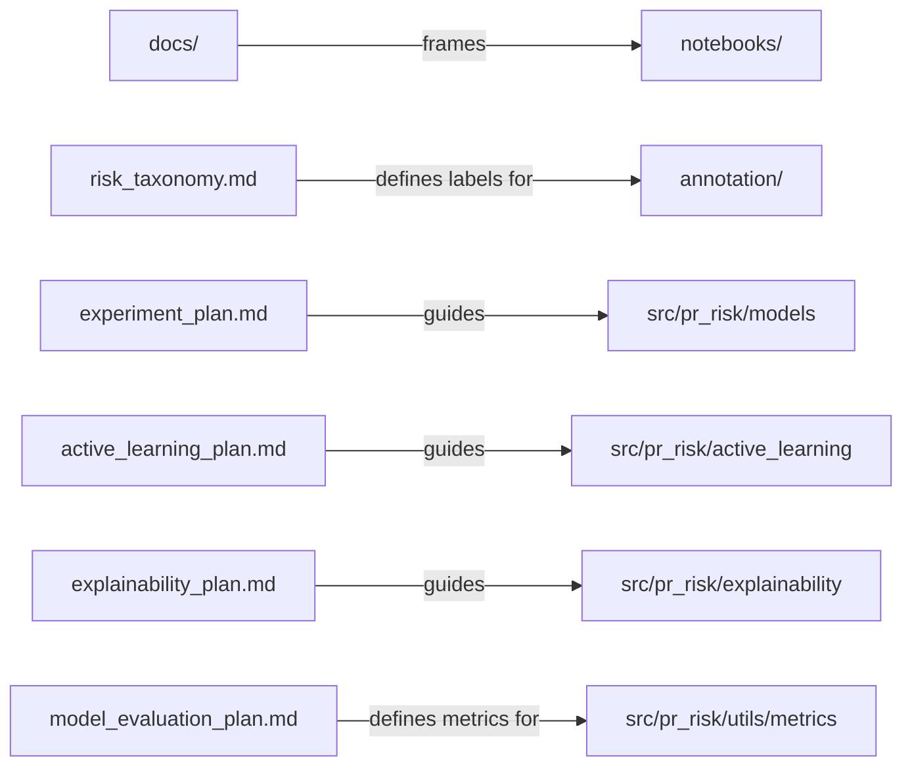

# Docs

Academic planning, methodology, and reference documentation for the project. This page is the **docs hub**: it lists every document here and summarises the supporting literature review.

## Documents in this folder

| Document | Read it for |
|---|---|
| [project_description.md](project_description.md) | One-paragraph framing of the project |
| [dataset_description.md](dataset_description.md) | PRismBench contents and handling rules |
| [risk_taxonomy.md](risk_taxonomy.md) | The 11 `risk_type` classes (canonical: [`annotation/label_schema.md`](../annotation/label_schema.md)) |
| [experiment_plan.md](experiment_plan.md) | Baseline models and feature-set comparisons |
| [active_learning_plan.md](active_learning_plan.md) | Seed → query → label → merge plan |
| [explainability_plan.md](explainability_plan.md) | SHAP / LIME / feature importance → suggestions |
| [model_evaluation_plan.md](model_evaluation_plan.md) | Metrics and evaluation focus |
| [environment_setup.md](environment_setup.md) | venv / conda / Colab / AWS notes |
| [aws_resource_request.md](aws_resource_request.md) | Starter AWS resource request |

> Suggested reading order: `project_description` → `dataset_description` → `risk_taxonomy` → `experiment_plan` → `active_learning_plan` → `explainability_plan` → `model_evaluation_plan`.

## How docs relate to the rest of the repo

---

## Literature review summary

> Full review: **[Predicting Pull Request (PR) Risks with Explanations using GitHub Data](https://docs.google.com/document/d/1lhZSNNUA0obLeGVKHI5n43s7bFr18n98GaxZqZfgsak/edit?usp=sharing)** (Google Doc). The summary below distils the parts most relevant to implementation. Bracketed numbers refer to that document's reference list.

### Research questions

| RQ | Question |
|---|---|
| RQ1 | How can GitHub PR data classify risks into fine-grained categories (bug, performance, security, …)? |
| RQ2 | How can XAI provide developers with understandable reasons for PR risk predictions? |
| RQ3 | How can active learning reduce manual labelling effort to extend PRismBench from binary to multi-class labels? |

### Gap this project addresses

The review finds that existing PR/defect-prediction work is **almost entirely binary** (risky/clean, accept/reject), provides **limited explainability**, and that **fine-grained labelled datasets are scarce**. This project targets all three: multi-class risk types, XAI-backed explanations, and active learning to label efficiently.

### Classification models (Section 4)

| Model category | Strengths | Limitations | XAI / suggestion potential |
|---|---|---|---|
| **Traditional ML** (LR, RF, XGBoost, SVM) | Strong for structured PR metadata; easy to train/explain | Limited semantic understanding of code/text | Strong feature-based explanations; RF & XGBoost pair well with SHAP |
| **Deep learning** (CNN, LSTM/BiLSTM, CNN-BiLSTM) | Learns patterns from code, text, sequences | Needs more data; low direct interpretability | Useful if risky code/text regions can be highlighted as suggestions |
| **Transformers** (CodeBERT, GraphCodeBERT, CodeT5) | Strongest code-text representation learning | High compute cost; harder to explain | Strong potential via attention, token attribution, LIME, SHAP, integrated gradients |

Empirically, tree ensembles (XGBoost, Random Forest) outperformed LR/SVM/KNN/Naïve Bayes on PR action recommendation, and **CodeBERT** is the selected base encoder because PRs combine natural language (descriptions) and code (diffs). Practical takeaway: start with interpretable baselines (LR/RF) → strong tabular (XGBoost) → CodeBERT for code-text semantics.

### Active learning strategies (Section 3)

| Strategy | Idea | Status in `src/pr_risk` |
|---|---|---|
| Pool-based sampling | Score a large static pool, pick the most informative | Setting used by notebook 04 |
| Least confidence | Lowest top-class probability | `query_strategies.least_confidence_sampling` ✅ |
| Margin | Smallest gap between top-2 classes (best for multi-class boundaries) | `query_strategies.margin_sampling` ✅ |
| Entropy | Highest predictive entropy | `query_strategies.entropy_sampling` ✅ |
| Diversity / representativeness | Cluster to cover all modules; avoid redundancy | `query_strategies.diversity_sampling` (placeholder) ⚠️ |
| Query-by-Committee | Disagreement among diverse models | Future work |
| Two-Stage (TAL) | Diversity then uncertainty (hybrid gold standard) | Future work |
| Evidence-based / partial & LLM-assisted queries | Conflicting vs. insufficient evidence; hierarchical feedback; LLM pre-screening | Future work |

### Explainability — LIME vs SHAP (Section 5)

| Dimension | LIME | SHAP |
|---|---|---|
| Theoretical basis | Local linear approximation | Cooperative game theory (Shapley values) |
| Scope | Strictly local | Local values + global interpretability |
| Consistency | Varies across runs (random perturbation) | Deterministic (TreeSHAP); approximate (KernelSHAP) |
| Computational cost | Moderate | High (KernelSHAP); fast (TreeSHAP) |
| Correlated features | Handled poorly | Handled better via conditional expectations |
| Feature interactions | Not modelled | Captured via interaction values |

Practical guidance from the review: treat **LIME/SHAP agreement on top-k features as a robustness signal** (they agree only ~40–60% of the time, mostly disagreeing near the decision boundary and under multicollinearity). GitHub PR metrics are highly multicollinear (LOC ↔ commits ↔ files changed ↔ complexity), so consider VIF analysis and **group-level** SHAP for correlated clusters.

### Tools surveyed (Section 6)

| Category | Tools | Relevance |
|---|---|---|
| Data mining | PyDriller, GHTorrent, SmartSHARK (SZZ), Kalliamvakou et al. (bias filtering) | Collect & filter PRs; trace defect-inducing changes |
| Code representation | TF-IDF / Word2Vec → **CodeBERT** → GraphCodeBERT, UniXcoder | Embed PR text + diffs (CodeBERT = primary encoder) |
| ML frameworks | JIT-SDP survey, ensemble benchmarks, MSDP (multi-class CodeBERT) | Ensemble baselines + multi-class extension evidence |
| Explainable AI | SHAP, LIME (incl. on ensembles) | Post-hoc explanations + evaluation protocol |
| Active learning | **modAL**, **small-text** | Iterative labelling loop over CodeBERT embeddings |

> Note: this starter repo currently implements classical baselines (scikit-learn) and TF-IDF text features. CodeBERT, modAL/small-text, and the heavier tools above are the planned next steps the literature points to — see each subpackage README for the implemented-vs-TODO status.
