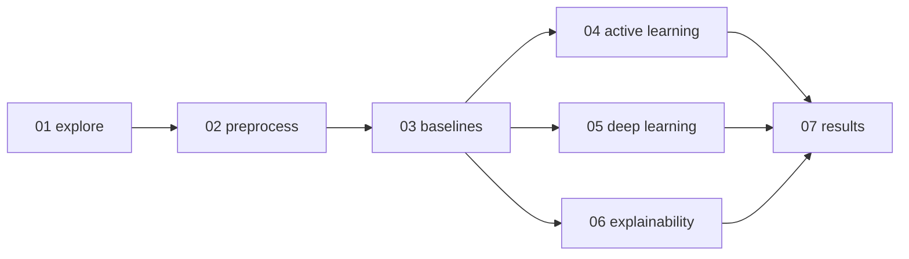

# Notebooks

Exploration and experiment narratives. Each notebook runs **end-to-end on the committed sample** (`data/sample/sample_prs.csv`) and imports reusable logic from [`src/pr_risk`](../src/pr_risk/README.md) — keep heavy logic in the package, keep notebooks thin.

## Run order

## Index

| # | Notebook | Purpose | Key `pr_risk` modules | Needs extras |
|---|---|---|---|---|
| 01 | [01_data_exploration](01_data_exploration.ipynb) | Schema, class balance, missing values, distributions | `data.load_data` | — |
| 02 | [02_preprocessing](02_preprocessing.ipynb) | Clean, normalise text, split, persist to `data/interim` | `data.clean_data`, `preprocess`, `split_data` | scikit-learn |
| 03 | [03_baseline_models](03_baseline_models.ipynb) | Metadata + TF-IDF features, train LR/RF, evaluate | `features.*`, `models.train_baseline`, `models.evaluate` | scikit-learn, scipy |
| 04 | [04_active_learning_simulation](04_active_learning_simulation.ipynb) | Query strategies + learning curves | `active_learning.query_strategies` | scikit-learn |
| 05 | [05_deep_learning_experiments](05_deep_learning_experiments.ipynb) | CodeBERT / embeddings scaffold (heavy parts gated) | `utils.config` + `configs/codebert.yaml` | transformers* |
| 06 | [06_explainability](06_explainability.ipynb) | Feature importance, SHAP, LIME → suggestions | `explainability.*` | shap, lime* |
| 07 | [07_results_analysis](07_results_analysis.ipynb) | Compare runs, plots, export figures | `utils.paths` + `experiments/*.csv` | — |

\* Notebooks 05 and 06 **guard** their heavy imports behind a `RUN_HEAVY = False` flag, so they open and run their light sections even without `torch`/`transformers`/`shap`/`lime`.

## Conventions

- Every notebook starts with a setup cell that adds `src/` to `sys.path` and loads the sample.
- A `TODO` marks each place where the real PRismBench dataset or a not-yet-implemented function plugs in.
- **Strip large outputs** before committing (`jupyter nbconvert --clear-output --inplace <nb>.ipynb`) to keep the repo small and reviewable.

## Sample vs. real data

The sample is tiny (10 rows, singleton classes). On it, the notebooks demonstrate *mechanics*; they do not produce meaningful metrics. For real runs, point the setup cell at `data/raw/` and use the stratified [`create_train_val_test_split`](../src/pr_risk/data/split_data.py).
