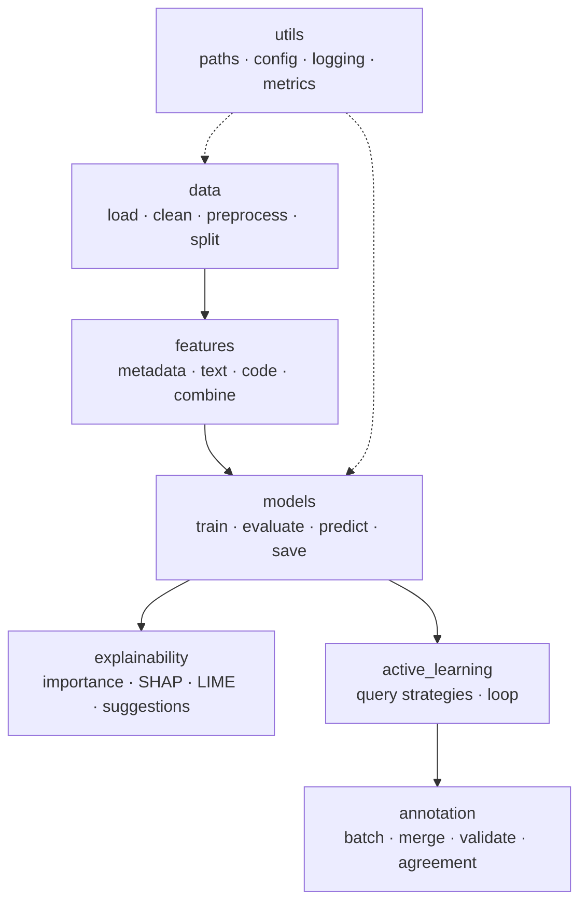

# `pr_risk` Package

The reusable core of the project. Notebooks and apps import from here so logic lives in one tested place. Installed-on-path via `pyproject.toml` (`pythonpath = ["src"]`), so `import pr_risk...` works after `pip install -r requirements.txt`.

## Subpackage map

| Subpackage | Responsibility | README |
|---|---|---|
| `data/` | Load, clean, preprocess, split datasets | [data/README.md](data/README.md) |
| `features/` | Metadata, text (TF-IDF), code-summary features + combine | [features/README.md](features/README.md) |
| `models/` | Train baselines/transformer, evaluate, predict, save | [models/README.md](models/README.md) |
| `active_learning/` | Query strategies and loop orchestration | [active_learning/README.md](active_learning/README.md) |
| `annotation/` | Build batches, merge/validate labels, agreement | [annotation/README.md](annotation/README.md) |
| `explainability/` | Feature importance, SHAP, LIME, suggestions | [explainability/README.md](explainability/README.md) |
| `utils/` | Paths, config loading, logging, metrics | [utils/README.md](utils/README.md) |

## Implementation status

Legend: ✅ implemented · 🟡 starter/partial (has a `TODO`) · ⛔ placeholder (`NotImplementedError`/empty).

| Module | Key functions | Status |
|---|---|---|
| `data.load_data` | `load_csv`, `save_csv` | ✅ |
| `data.clean_data` | `basic_cleaning` | 🟡 |
| `data.preprocess` | `preprocess_pr_dataset` | 🟡 |
| `data.split_data` | `create_train_val_test_split` (stratified) | ✅ |
| `features.metadata_features` | `create_metadata_features` | 🟡 |
| `features.text_features` | `create_text_features_tfidf` | ✅ |
| `features.code_features` | `create_code_summary_features` | 🟡 |
| `features.feature_pipeline` | `combine_features` | ✅ |
| `models.train_baseline` | `train_logistic_regression`, `train_random_forest` | ✅ |
| `models.evaluate` | `evaluate_classification_model` | ✅ |
| `models.predict` | `predict_risk_and_type` | ✅ |
| `models.save_model` | `save_model`, `load_model` | ✅ |
| `models.train_transformer` | CodeBERT fine-tuning | ⛔ |
| `active_learning.query_strategies` | `random/least_confidence/entropy/margin_sampling` | ✅ |
| `active_learning.query_strategies` | `diversity_sampling` | 🟡 (random fallback) |
| `active_learning.active_learning_loop` | `active_learning_loop` | ⛔ |
| `annotation.create_annotation_batch` | `create_annotation_batch` | ✅ |
| `annotation.merge_labels` | `merge_new_labels` | ✅ |
| `annotation.validate_labels` | `validate_label_schema` | ✅ |
| `annotation.agreement` | `calculate_basic_agreement` (exact-match) | 🟡 |
| `explainability.feature_importance` | `explain_with_feature_importance` | ✅ |
| `explainability.explanation_generator` | `generate_human_readable_explanation` | ✅ |
| `explainability.shap_explainer` | `explain_with_shap` | ⛔ |
| `explainability.lime_explainer` | `explain_with_lime` | ⛔ |
| `utils.*` | `paths`, `config.load_config`, `logging.get_logger`, `metrics.classification_metrics` | ✅ |

## Conventions

- Pure, importable functions — no top-level side effects.
- Type hints + short docstrings on every public function.
- Add a test under [`tests/`](../../tests/README.md) when you implement or change a function.
- Lint/format with `ruff` + `black` (config in [`pyproject.toml`](../../pyproject.toml)).
